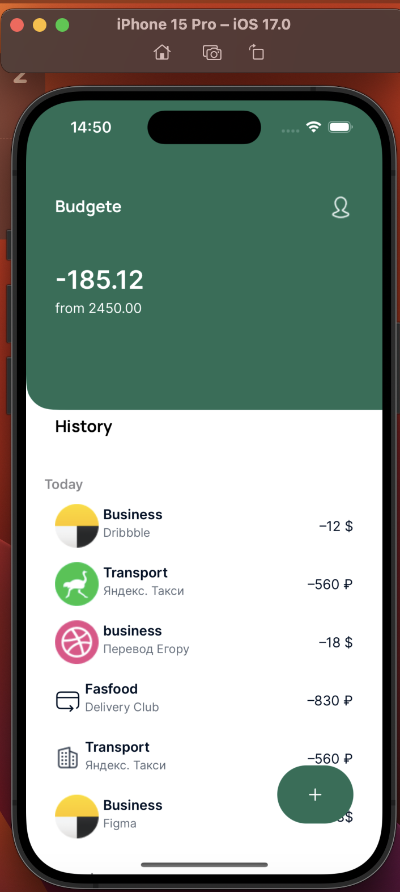
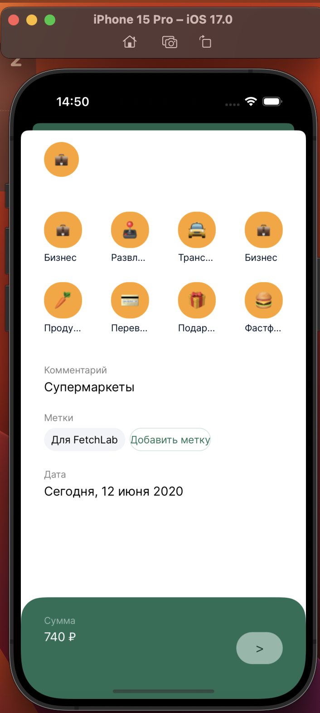

#  Budget project

i made this project to show my abiblities in swift. The main goal was to improve skills when creatin view elements in swift through code (without storyboard).
Unfortunally i didn't set whole functionality. All buttons didn't work. But not for whole long time. I will finish whole project as soon as posible

At first i used SnapKit library for creating elements.
I could use NSLayoutConstraints, but it will be too much code. 
I choosed SnapKit to minimize the amount lines of code. Also SnapKit easy to read and understand.

Structure of program:
1) Main View Controller (ViewController()) -> represent whole view
    * Then created custom View to to represed top view (BudjeteHeaderView())
    * and other view elements
2) Secound View Controller (SecoundViewContorller) - > this ViewController use to add New expenses
    * Created all views
    * created Button by determine functions. To minimize code
    * and last created custom view for bottom part.
    
#Screenshots

